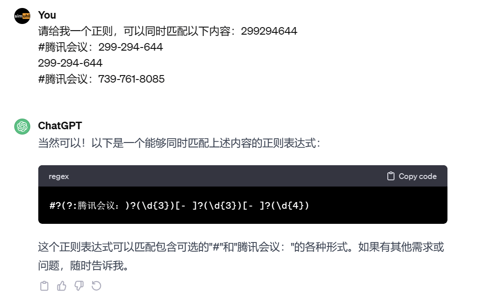

# 如何使用？
1. 复制你的会议号，如下样式的内容均可自动识别：
+ 299294644
+ #腾讯会议：299-294-644
+ 299-294-644
+ #腾讯会议：739-761-8085
2. 唤醒utools即可识别快速进入腾讯会议


-------
# 原理
腾讯会议可以基于以下schema快速打开，meeting_code即为会议号
wemeet://page/inmeeting?meeting_code=299294644

# 正则匹配
+ 299294644
+ #腾讯会议：299-294-644
+ 299-294-644
+ #腾讯会议：739-761-8085


```regexp
这是chatgpt给的答案:
#?(?:腾讯会议：)?(\d{3})[- ]?(\d{3})[- ]?(\d{4})
稍作调整一下，测试得到正确答案:
#?(?:腾讯会议：)?(\d{3})[- ]?(\d{3})[- ]?(\d{3,4})
```

